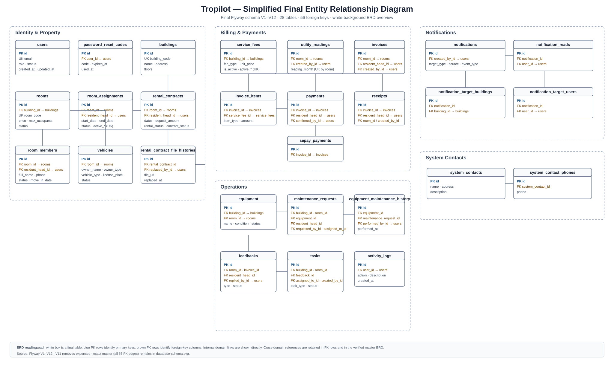
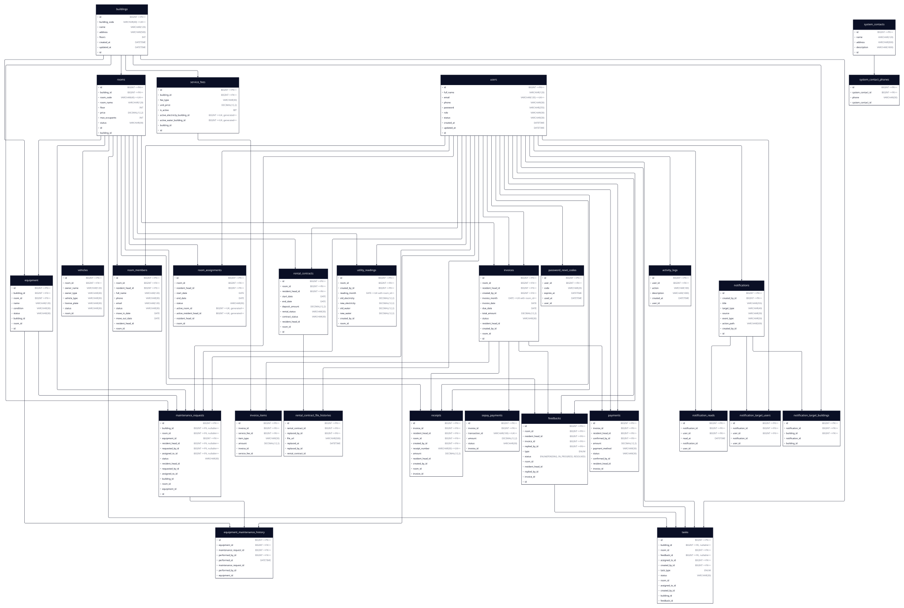

# Tropilot Final Database Schema ERD

Source of truth: Flyway migrations [`V1__baseline_schema.sql`](../../../tropilot-backend/src/main/resources/db/migration/V1__baseline_schema.sql) through `V12__simplify_feedback_statuses.sql`.

The final schema contains **28 tables** and **56 foreign keys**. `expenses` is excluded because `V11__remove_expenses_feature.sql` drops it.

## Report-friendly ERD overview

This white-background overview is intended for the report and Word. It groups related entities, shows the primary and foreign-key fields in each entity, and draws only relationships that stay within the same domain so the diagram remains readable.

## Full technical master

The technical master retains every verified foreign-key relationship, including cross-domain relationships.

## ERD conventions

- Each box is a physical database table drawn as an ERD entity.
- `PK` marks a primary key; `FK` marks a foreign-key column.
- The white overview keeps local relationship lines visible and uses FK field names for cross-domain references, avoiding a web of crossing lines.
- The technical master represents every final foreign-key relationship; the child column is named in its class box.
- Generated active-key fields and final constraints added by `V3` are shown in `room_assignments` and `service_fees`.

## Final table inventory

| Domain | Tables |
|---|---|
| Identity and property | users, password_reset_codes, buildings, rooms, room_assignments, room_members, vehicles, rental_contracts, rental_contract_file_histories |
| Billing and payments | service_fees, utility_readings, invoices, invoice_items, payments, receipts, sepay_payments |
| Operations | equipment, equipment_maintenance_history, maintenance_requests, feedbacks, tasks, activity_logs |
| Notifications | notifications, notification_reads, notification_target_buildings, notification_target_users |
| System contacts | system_contacts, system_contact_phones |

## Final migration adjustments applied

| Migration | Final-schema effect |
|---|---|
| V2 | Required notification target type; nullable maintenance request room/resident head; required invoice date |
| V3 | Invoice and utility-reading unique keys; active assignment/service-fee generated unique keys |
| V4 | Adds password_reset_codes and fk_password_reset_codes_user |
| V5 | Adds tasks.building_id and fk_tasks_building |
| V6 | Adds tasks.feedback_id and fk_tasks_feedback; final feedback linkage |
| V8–V10 | Adds notification metadata and final task type values |
| V11 | Drops expenses and its two baseline foreign keys |
| V12 | Final feedback status enum: PENDING, IN_PROGRESS, RESOLVED |

## Verification

The `.d2` source contains the 28 final table names and 56 final FK edges. The set is calculated as 55 baseline FKs, minus 2 FKs removed with `expenses`, plus the 3 FKs added by V4–V6. A source comparison against the migrations reports **expected 56 / ERD 56 / missing 0 / extra 0**.
